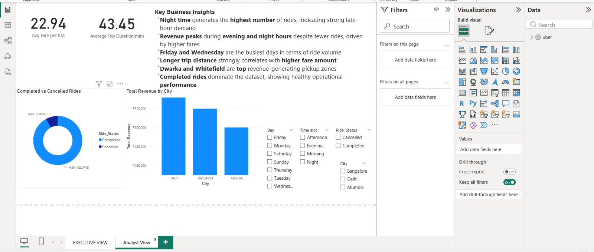

# Uber Ride Analytics – Power BI Dashboard

## Project Overview
This project analyzes Uber ride data using **Power BI** to uncover ride demand patterns, revenue trends, peak hours, and operational insights.  
The dashboard is designed with two perspectives:
- **Executive View** – High-level KPIs and summary insights
- **Analyst View** – Detailed trends, breakdowns, and correlations

---

## Business Objectives
- Identify peak ride demand time slots
- Analyze revenue trends by hour and day
- Compare completed vs cancelled rides
- Understand distance–fare relationship
- Identify top revenue-generating cities and pickup zones

---

## Dataset Details
- **Total Records:** 5,000 rides  
- **Cities:** Bangalore, Delhi, Mumbai  
- **Time Attributes:** Hour, Day, Time Slot (Morning, Afternoon, Evening, Night)  
- **Metrics:** Distance (KM), Fare Amount, Trip Duration, Ride Status  

> Dataset is simulated for learning and portfolio purposes.

---

## Key KPIs
- **Total Rides**
- **Total Revenue**
- **Average Fare**
- **Average Distance (KM)**
- **Average Fare per KM**
- **Average Trip Duration**

---

## Dashboards

###  Executive View

**Insights:**
- Night time generates the highest number of rides
- Revenue peaks during evening and night hours
- Friday and Wednesday are the busiest days
- Longer trip distance strongly correlates with higher fare
- Indiranagar and Whitefield are top revenue pickup zones
- Completed rides dominate, indicating healthy operations

---

###  Analyst View

**Analysis Includes:**
- Revenue by hour trend
- Rides by day and time slot
- Revenue by city and pickup zone
- Distance vs Fare correlation analysis
- Ride status distribution

---

## Tools & Skills Used
- **Power BI**
- **DAX Measures**
- **Data Modeling**
- **Data Visualization**
- **Business Analysis**
- **Dashboard Design**

---

## File Structure

---

## How to Use
1. Download the `.pbix` file  
2. Open in **Power BI Desktop**  
3. Explore Executive and Analyst views using slicers  

---

## Author
**Krishna Ravtani**  
Aspiring Data Analyst  
India

---

## License
This project is licensed under the MIT License.

